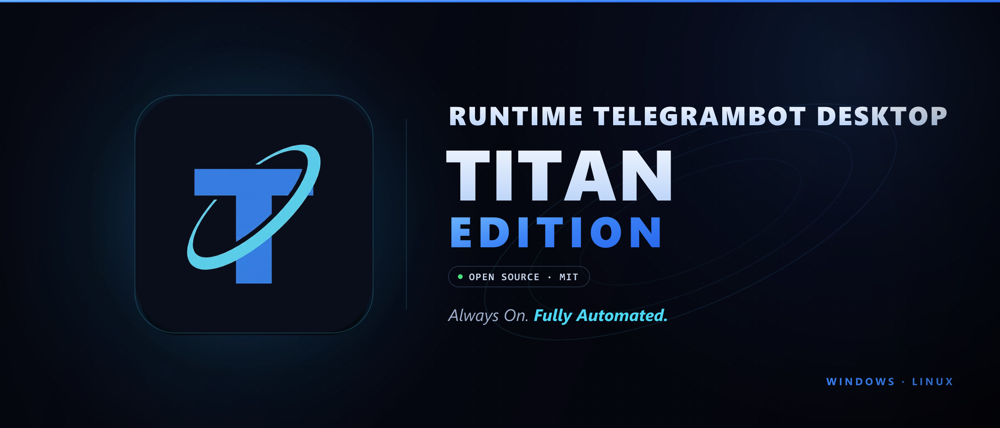

<div align="center">
  

  # Runtime TelegramBot Desktop
  ### Titan Edition

  **Automazione multi-canale di feed RSS, podcast e YouTube su Telegram.**

  
  
  
  
  
</div>

---

## Che cos'è

Un'applicazione desktop che sorveglia feed RSS, podcast e canali YouTube e pubblica automaticamente i nuovi contenuti su canali Telegram. Gestisce più bot e più canali contemporaneamente da un'unica interfaccia, gira interamente sulla tua macchina e non parla con nessun server che non siano i feed, Telegram e YouTube.

Nasce nel 2025 come script Python da terminale per i canali di [Runtime Radio](https://runtimeradio.com) e diventa applicazione Electron nel corso del 2026. È stato distribuito come prodotto commerciale fino all'agosto 2026, quando è stato ritirato dalla vendita e aperto sotto licenza MIT.

> **Stato del progetto.** Funzionalmente completo e in produzione. Non ci sono sviluppi pianificati: viene mantenuto per correzioni. Le pull request sono benvenute — vedi [CONTRIBUTING.md](CONTRIBUTING.md).

---

## Funzionalità

### Nucleo
- **Multi-bot e multi-canale** — orchestrazione simultanea di più bot Telegram, con log in tempo reale filtrabile per bot.
- **YouTube senza API key** — accesso via InnerTube, nessuna chiave Google Cloud. Cache di 5 minuti e filtro anti-premiere integrato.
- **Token cifrati** — `safeStorage` del sistema operativo come primario, AES-256-GCM con chiave macchina come fallback. Portabilità tramite il formato `.rtb`.
- **Architettura producer-consumer** — scaricamento dei feed e invio su Telegram su binari separati, con gestione di FloodWait e rate-limit.
- **Quiet Hours** — fasce di silenzio per bot. I contenuti si accumulano in una coda persistente su disco e vengono smaltiti alla ripresa, anche dopo un riavvio.
- **Template** — editor visuale per i messaggi Telegram con variabili (`{{title}}`, `{{link}}`, `{{summary}}`, `{{feedName}}`) e validatore in tempo reale. Quattro modelli separati: avvio, news, podcast, YouTube.
- **Retry queue** — gli invii falliti vengono riaccodati fino a 3 tentativi.

### Avanzate
- **Filtro per parole chiave** — include/exclude per singolo feed.
- **Scheduler per feed** — intervallo di controllo individuale, da 5 minuti a 24 ore, indipendente da quello del bot.
- **Statistiche** — contatori giornalieri, settimanali e totali con dettaglio per feed.
- **Anteprima template** — resa inline con dati campione.
- **Import OPML** — importazione in blocco, senza dipendenze esterne, con validazione anti-SSRF.
- **Digest** — accumula i contenuti di un feed per un intervallo configurabile (da 1 ora a 7 giorni) e li invia in un unico messaggio.
- **Performance Mode** — disattiva scanline, blur, glow e animazioni sulle macchine lente.
- **Aggiornamento automatico** — controllo all'avvio, download e installazione su conferma, con schermata delle novità al primo riavvio.
- **Documentazione integrata** — guida rapida a schermo nella lingua corrente e manuale completo in PDF.

### Lingue
🇮🇹 Italiano · 🇬🇧 English

L'italiano è la lingua sorgente: interfaccia, guide e manuale nascono lì e vengono poi portati in inglese. Fino alla 2.1.7 le lingue erano otto; francese, tedesco, spagnolo, portoghese, russo e cinese sono state ritirate con la 2.1.8.

---

## Stack

| Livello | Tecnologia |
| :--- | :--- |
| **Framework** | Electron 32 + Node.js 20 |
| **Frontend** | React 18 + Vite 5 |
| **Stile** | TailwindCSS + Lucide React |
| **Database** | SQLite via `better-sqlite3` (WAL, schema v12) |
| **Telegram** | Telegraf v4 |
| **YouTube** | `youtubei.js` (InnerTube) |
| **Build** | electron-builder 25 — NSIS, portable, AppImage, deb, rpm, pacman, tar.gz |
| **CI** | GitHub Actions (Windows x64, Linux x64 e arm64) |

---

## Installazione

### Utenti

Scarica l'installer dalla [pagina delle release](https://github.com/Pitz72/Runtime-TelegramBot-Desktop-Titan-Edition/releases/latest):

- **Windows** — `Setup-*.exe`, l'installer NSIS. C'è anche una versione **portable**, un eseguibile unico che non installa niente e non si aggiorna da solo. Non essendo firmati, SmartScreen mostrerà un avviso al primo avvio: *Ulteriori informazioni* → *Esegui comunque*.
- **Linux** — `.AppImage` (da rendere eseguibile con `chmod +x`), `.deb` per Ubuntu, Debian e derivate, `.rpm` per Fedora, RHEL e openSUSE, `.pacman` per Arch, oppure l'archivio `.tar.gz`. Ogni file esiste in versione **x64** e **arm64**. Potrebbero servire `libsecret-1-0` e `libfuse2`.

Piattaforme con installer precompilato: **Windows x64** e **Linux x64 e arm64**.

Si aggiornano da soli l'installer Windows e l'AppImage; `.deb` e `.rpm` ci provano ma chiedono la password di amministratore. Il portable, il `.pacman` e il `.tar.gz` vanno riscaricati a mano.

**macOS non ha un installer ufficiale.** Non è un limite tecnico — il codice è cross-platform e Electron gira su macOS senza modifiche — ma distribuire un `.dmg` che non faccia comparire l'avviso di Gatekeeper richiede un certificato Apple a pagamento, e non ha senso mantenerlo per un progetto senza entrate. Chi usa macOS può **compilare l'applicazione dal sorgente** seguendo le istruzioni per sviluppatori qui sotto: servono Node 20 e Xcode Command Line Tools, e `npm run build` produce l'app. La documentazione, i manuali e le guide descrivono solo Windows e Linux.

### Sviluppatori

```bash
git clone https://github.com/Pitz72/Runtime-TelegramBot-Desktop-Titan-Edition.git
cd Runtime-TelegramBot-Desktop-Titan-Edition
npm install

npx tsc --noEmit    # type check
npx vite build      # build dei bundle
npm run build       # build completa + installer
```

> ⚠️ **Non usare `npm run dev`**: il dev server corrompe `dist-electron/main/index.cjs`. È un bug noto e diagnosticato — la spiegazione, insieme alle altre trappole del progetto, è in [CONTRIBUTING.md](CONTRIBUTING.md).

---

## Struttura

```
├── src/
│   ├── main/                 # motore, SQLite, IPC, cifratura, logger
│   ├── renderer/             # interfaccia React, i18n, guide in-app
│   ├── preload/              # bridge IPC
│   └── shared/               # tipi condivisi
├── docs/                     # documentazione tecnica, guide, changelog
│   ├── storico/              # materiale d'epoca, non più aggiornato
│   └── idee/                 # progetti analizzati e mai realizzati
├── Manuale Utente Avanzato/  # manuale in italiano e inglese + sorgenti Typst
├── branding/                 # banner e asset grafici
├── build/  ·  resources/     # icone e risorse di packaging
└── .github/workflows/        # CI
```

---

## Documentazione

| | |
| :--- | :--- |
| [Indice della documentazione](docs/README.md) | Punto di partenza |
| [CONTRIBUTING.md](CONTRIBUTING.md) | Come compilare e contribuire, e cosa non toccare |
| [SECURITY.md](SECURITY.md) | Modello di sicurezza e segnalazione vulnerabilità |
| [docs/architettura.md](docs/architettura.md) | Whitepaper architetturale |
| [docs/database.md](docs/database.md) | Schema SQLite e migrazioni |
| [CHANGELOG.md](CHANGELOG.md) | Storia delle versioni |
| [Manuale Utente Avanzato](Manuale%20Utente%20Avanzato/) | Manuale completo, italiano e inglese |

---

## Sostenere il progetto

Titan è gratuito e a sorgente aperto, e resterà così. Se ti è utile e vuoi contribuire alle spese di sviluppo, o se semplicemente vuoi scrivermi — segnalazioni, domande, proposte di collaborazione — trovi tutto qui:

### 👉 **[simonepizzi.runtimeradio.it/contatti](https://simonepizzi.runtimeradio.it/contatti)**

Per una donazione diretta: **[paypal.me/runtimeradio](https://www.paypal.com/paypalme/runtimeradio)**

Entrambi i collegamenti sono raggiungibili anche dall'applicazione, dalla schermata iniziale e da Impostazioni di Sistema → Generale.

---

## Privacy

L'applicazione funziona in locale. Contatta esclusivamente i server dei feed configurati, `api.telegram.org`, gli endpoint di YouTube e GitHub per il controllo degli aggiornamenti. Nessuna telemetria, nessun analytics, nessun account. I token restano cifrati sulla tua macchina e non lasciano mai il tuo disco.

---

## Come è stato scritto

Questo programma è stato scritto facendo un **uso massiccio di modelli linguistici di grandi dimensioni**: Google **Gemini**, dalla 2.5 alla 3.1, e Anthropic **Claude**, da Sonnet 4.6 a Opus 5. Gran parte del codice che leggi l'hanno prodotta loro, ed è giusto che sia dichiarato apertamente.

Tutto il resto è di **Simone Pizzi**: il concetto, la visione, la direzione progettuale, la definizione minuziosa di ogni dettaglio funzionale e la caccia ostinata ai bug. Ogni comportamento del programma — dal filtro di cutoff iper-pessimista alla coda persistente delle quiet hours, dalla deduplica scoped per tipo di contenuto al modo in cui si presenta un aggiornamento — è una decisione progettuale presa, verificata sul campo e corretta a mano fino a farla funzionare.

I modelli hanno scritto il codice. Le decisioni, dalla prima all'ultima, sono state sue.

Questo vale anche per la documentazione: manuali, guide e note tecniche sono stati redatti con lo stesso metodo, e revisionati riga per riga.

---

## Licenza

Rilasciato sotto licenza **MIT** — vedi [LICENSE](LICENSE).

Sviluppato da **Simone Pizzi** per **[Runtime Radio](https://runtimeradio.com)**.

Fino ad agosto 2026 il progetto è stato distribuito commercialmente sotto una licenza proprietaria, conservata a titolo storico in [`docs/storico/EULA-v1-proprietaria.txt`](docs/storico/EULA-v1-proprietaria.txt). Quella licenza non si applica più: il software è ora liberamente utilizzabile, modificabile e ridistribuibile secondo i termini MIT.
